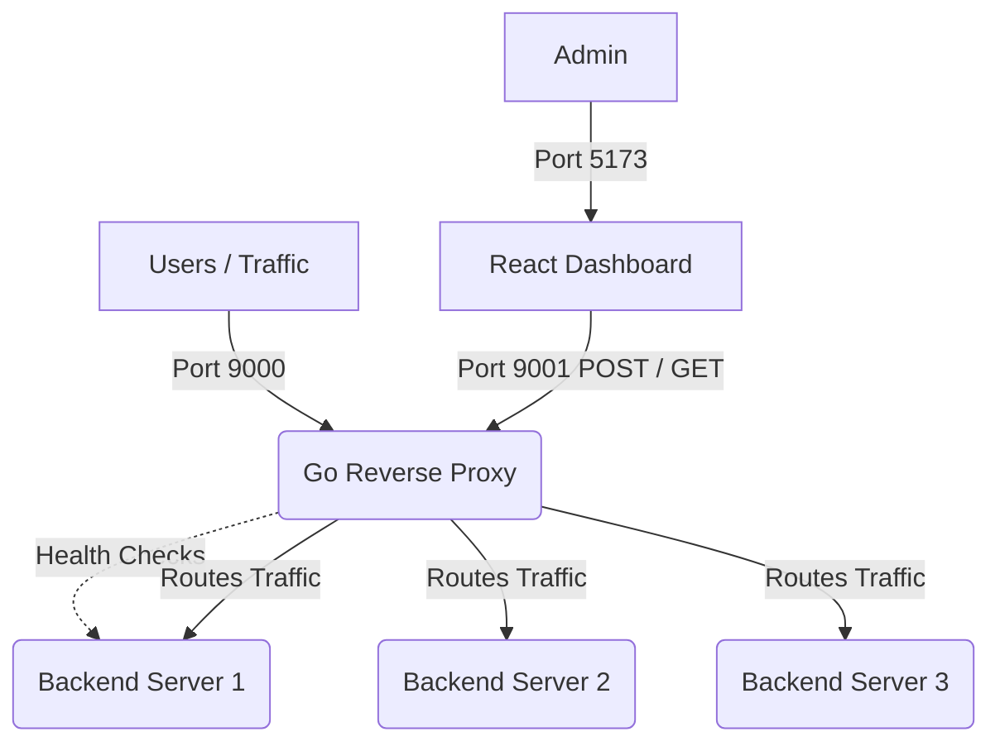

# PulseMesh 🌐

PulseMesh is a high-performance, fault-tolerant **Enterprise Traffic Management Platform** built from scratch in Go. It acts as a dynamic Reverse Proxy and Load Balancer, featuring an independent React-based Control Plane for real-time traffic monitoring and administrative overrides.

## ✨ Key Features

*   **Advanced Load Balancing:** Supports dynamic switching between `Least Connections`, `Round Robin`, and `Weighted Round Robin` algorithms while actively serving traffic.
*   **High Availability & Health Checks:** A background goroutine continuously monitors backend health. Dead servers are instantly dropped from the routing pool to prevent dropped connections.
*   **Concurrency Safety:** Built for massive traffic spikes using Go's `sync/atomic` hardware-level counters and `sync.RWMutex` to completely eliminate data races.
*   **Dual-Port Architecture:** Safely separates user traffic (Port 9000) from the secure administrative REST API (Port 9001).
*   **Live React Dashboard:** A premium, component-based frontend that visualizes live metrics (Active Connections, Response Times) and allows administrators to manually Force Offline servers or dynamically add new ones.

## 🏗️ Architecture



## 🚀 Getting Started

### Prerequisites
*   [Go](https://go.dev/dl/) (1.20+)
*   [Node.js](https://nodejs.org/) & npm

### Running the Platform

Because PulseMesh relies on a microservice architecture, you will need to open multiple terminal windows to simulate a distributed environment.

**1. Start the Backend Servers**
Open a terminal and start as many backend servers as you want (they run independently):
```bash
go run backend/main.go -port=8081
go run backend/main.go -port=8082
go run backend/main.go -port=8083
```

**2. Start the Load Balancer (Data Plane + Control Plane)**
Open a new terminal and start the core proxy engine:
```bash
go run proxy/proxy.go
```
*The Data Plane will listen on `:9000` and the Control Plane API on `:9001`.*

**3. Start the React Dashboard**
Open a new terminal, navigate to the dashboard directory, and run the Vite server:
```bash
cd dashboard
npm install
npm run dev
```

### Testing the Load Balancer
You can simulate user traffic by sending cURL requests to the Load Balancer:
```bash
curl http://localhost:9000
```
Watch the React Dashboard update instantly as the proxy routes your traffic across the active backend servers!

## 🛠️ Tech Stack
*   **Backend:** Go (Golang), `net/http`, `net/http/httputil`, `sync/atomic`
*   **Frontend:** React, Vite, Vanilla CSS (Glassmorphism UI)
